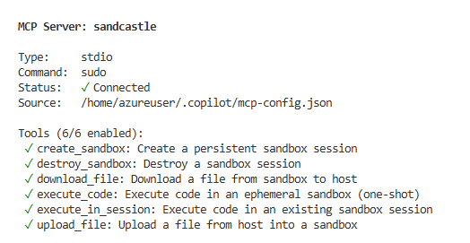

# 🏰 Sandcastle

**Tiered sandbox execution for AI agents via MCP.**

Sandcastle is an MCP (Model Context Protocol) tool that gives any AI agent secure, sandboxed code execution. Agents call `execute_code` — Sandcastle handles isolation, resource limits, network restrictions, and cleanup.

## Why Sandcastle?

AI agents need to execute code. But executing untrusted code on your infrastructure is dangerous:
- Code could exfiltrate data over the network
- Code could consume unlimited CPU/memory
- Code could access the host filesystem
- Code could run indefinitely

Sandcastle solves this by providing **sandboxed execution as an MCP tool**. Any AI agent that speaks MCP can safely execute code without the agent developer thinking about isolation.

## Key Features

- **🔒 Three isolation levels** — Choose the right security/performance tradeoff
- **🔌 MCP-native** — Works with any MCP-compatible agent (Claude, GPT, Copilot, custom)
- **⚡ Fast** — Pre-warmed sandbox pools, snapshot-based restore
- **🌐 Network control** — No network by default, allowlist specific domains
- **📦 Multi-language** — Python, JavaScript, Bash, Rust, Go, and more
- **⏱️ Time-bound** — Automatic timeout and cleanup
- **💰 Usage-based** — Pay for what you use (execution seconds)

## Isolation Levels

| Level | Backend | Boot Time | CPU Overhead | Security | Default |
|-------|---------|-----------|-------------|----------|---------|
| `low` | Linux namespaces + seccomp + cgroups | ~5ms | ~0% | Process isolation | |
| `medium` | gVisor (runsc) | ~50ms | ~20% | Syscall interception | ✅ |
| `high` | Firecracker microVM | ~250ms | ~1% | Hardware virtualization (KVM) | |

- **Low**: For trusted code — math calculations, text formatting, data parsing. Fastest, lightest.
- **Medium** (default): For general untrusted code. gVisor intercepts every syscall — no direct kernel access. Good balance of speed and security.
- **High**: For fully untrusted code — user submissions, internet-sourced code, potential malware. Each execution runs in its own Firecracker microVM with hardware-level isolation via KVM.

## Demo

### MCP Tools on Agent Dashboard

<!-- Replace with screenshot of the MCP tool configs as seen on the agent dashboard -->


### Live Demo — All 3 Isolation Levels

<!-- Replace with a GIF showing live execution across low, medium, and high isolation -->


### One-shot execution (ephemeral sandbox)
```
You: "Run print('hello from sandcastle') in python using low isolation"

→ Copilot calls execute_code tool:
  { "code": "print('hello from sandcastle')", "language": "python", "isolation": "low" }

→ Result:
  { "stdout": "hello from sandcastle\n", "exit_code": 0, "execution_time_ms": 12 }
```

### Persistent session (stateful sandbox)
```
You: "Create a python sandbox, define a function, then call it"

→ Step 1: create_sandbox { "language": "python", "isolation": "medium" }
  Result: { "session_id": "sb-a1b2c3d4-..." }

→ Step 2: execute_in_session { "session_id": "sb-a1b2c3d4-...", "code": "def greet(name): return f'Hello, {name}!'" }
  Result: { "stdout": "", "exit_code": 0 }

→ Step 3: execute_in_session { "session_id": "sb-a1b2c3d4-...", "code": "print(greet('Sandcastle'))" }
  Result: { "stdout": "Hello, Sandcastle!\n", "exit_code": 0 }

→ Step 4: destroy_sandbox { "session_id": "sb-a1b2c3d4-..." }
```

### File transfer
```
You: "Upload a CSV, process it in Python, and download the result"

→ upload_file   { "session_id": "...", "path": "/workspace/data.csv", "content": "name,score\nAlice,95\nBob,87" }
→ execute_in_session { "session_id": "...", "code": "import csv\nwith open('/workspace/data.csv') as f: ..." }
→ download_file { "session_id": "...", "path": "/workspace/result.json" }
  Result: { "content": "{\"average\": 91.0}" }
```

### Firecracker microVM (high isolation)
```
You: "Execute untrusted code with maximum isolation"

→ execute_code { "code": "import os; print(os.uname())", "language": "python", "isolation": "high" }
  Result: { "stdout": "posix.uname_result(sysname='Linux', ...)\n", "exit_code": 0, "execution_time_ms": 280 }
  # Ran inside a dedicated Firecracker microVM with KVM hardware isolation
```

## 🤖 AI-Native Repository

This repository is **AI-native** — it is designed from the ground up for AI agents to read, understand, and contribute to.

### How it works

Any AI agent (Copilot, Claude, GPT, or custom) can onboard itself by reading the **`.context_bank/`** directory, which contains the project's source-of-truth documentation:

| File | Purpose |
|------|---------|
| `OVERVIEW.md` | What Sandcastle is, repo layout, current status, quick commands |
| `ARCHITECTURE.md` | System design, crate structure, data flow diagrams |
| `CRATE_REFERENCE.md` | Per-crate API reference and key types |
| `CONVENTIONS.md` | Coding rules, build commands, workflow rules |
| `KNOWN_ISSUES.md` | Gotchas, quirks, and lessons learned |

Additional product and technical docs live in `docs/`.

### Contributing with AI

1. **Read** `.context_bank/` to understand the project
2. **Branch** from `main` (never push directly)
3. **Build** with `cargo build` and **test** with `cargo test` (see `CONVENTIONS.md` for all commands)
4. **Update `.context_bank/`** if your changes affect architecture, conventions, or known issues
5. **Raise a PR** for review

> **Rule**: Every PR that changes architecture, adds crates, modifies conventions, or introduces known issues **must** include corresponding updates to `.context_bank/`. This keeps the AI onboarding docs accurate for the next contributor — human or AI.

## MCP Tools

### `create_sandbox`
Create a persistent sandbox session for multi-step execution.

```json
{
  "name": "create_sandbox",
  "arguments": {
    "language": "python",
    "isolation": "medium",
    "timeout_seconds": 300,
    "memory_mb": 512,
    "cpu_cores": 1,
    "allowed_domains": ["pypi.org", "files.pythonhosted.org"],
    "env_vars": {"API_KEY": "..."}
  }
}
```

Returns: `{ "sandbox_id": "sb-a1b2c3d4" }`

### `execute_code`
Execute code in a new ephemeral sandbox (one-shot) or existing sandbox.

```json
{
  "name": "execute_code",
  "arguments": {
    "code": "print('hello world')",
    "language": "python",
    "isolation": "medium",
    "timeout_seconds": 30
  }
}
```

Returns:
```json
{
  "stdout": "hello world\n",
  "stderr": "",
  "exit_code": 0,
  "execution_time_ms": 45,
  "timed_out": false
}
```

### `execute_in_sandbox`
Execute code in an existing sandbox session (preserves state between calls).

```json
{
  "name": "execute_in_sandbox",
  "arguments": {
    "sandbox_id": "sb-a1b2c3d4",
    "code": "x = 42",
    "timeout_seconds": 10
  }
}
```

### `upload_file`
Inject a file into a sandbox.

```json
{
  "name": "upload_file",
  "arguments": {
    "sandbox_id": "sb-a1b2c3d4",
    "path": "/workspace/data.csv",
    "content": "name,age\nAlice,30\nBob,25"
  }
}
```

### `download_file`
Pull a file out of a sandbox.

```json
{
  "name": "download_file",
  "arguments": {
    "sandbox_id": "sb-a1b2c3d4",
    "path": "/workspace/output.json"
  }
}
```

### `destroy_sandbox`
Destroy a sandbox and all its data.

```json
{
  "name": "destroy_sandbox",
  "arguments": {
    "sandbox_id": "sb-a1b2c3d4"
  }
}
```

## Quick Start

### Automated Setup (Recommended)
```bash
git clone https://github.com/pruthvirajdgit/sandcastle.git
cd sandcastle
sudo ./scripts/setup.sh
```

This installs all dependencies, builds the project, creates rootfs images, and configures MCP. Note that Copilot CLI launches the MCP server via `sudo`, so you must have passwordless sudo configured; otherwise `/mcp` may hang or fail. After completion, start a Copilot CLI session and run `/mcp` to verify.

### Manual MCP Configuration
If you prefer manual setup, add to `~/.copilot/mcp-config.json` (requires passwordless sudo):
```json
{
  "mcpServers": {
    "sandcastle": {
      "type": "stdio",
      "command": "sudo",
      "args": ["/path/to/sandcastle/service/target/debug/sandcastle", "serve", "--transport", "stdio"]
    }
  }
}
```

## Architecture

```
┌─────────────────────────────────┐
│         AI Agent (Any)          │
│   Claude / GPT / Copilot / ... │
└──────────┬──────────────────────┘
           │ MCP Protocol (stdio or HTTP)
┌──────────▼──────────────────────┐
│      Sandcastle MCP Server      │
│         (Rust binary)           │
├─────────────────────────────────┤
│       Sandbox Pool Manager      │
│  ┌─────┐  ┌───────┐  ┌──────┐  │
│  │ Low │  │Medium │  │ High │  │
│  │Pool │  │ Pool  │  │ Pool │  │
│  └──┬──┘  └───┬───┘  └──┬───┘  │
│     │         │          │      │
│  ns+sec   gVisor     Firecracker│
│  +cgroup  (runsc)    (KVM)      │
└─────────────────────────────────┘
           │
    ┌──────▼──────┐
    │  Executor   │
    │ (inside     │
    │  sandbox)   │
    │             │
    │ Run code    │
    │ Capture I/O │
    │ Return      │
    └─────────────┘
```

## Security Model

### Network
- **Default: no network access** — sandbox cannot make any outbound connections
- **Allowlist**: specify exact domains the sandbox can reach (e.g., package registries)
- **No inbound**: nothing from outside can reach into the sandbox
- Communication between host and sandbox uses vsock (Firecracker) or Unix pipes (gVisor/namespaces) — not TCP/IP

### Filesystem
- **Ephemeral**: sandbox filesystem is destroyed after use
- **No host mounts**: sandbox cannot see the host filesystem
- **Working directory**: `/workspace` — all file operations scoped here

### Resources
- **CPU**: configurable core count, enforced via cgroups
- **Memory**: configurable limit, OOM-killed if exceeded
- **Time**: hard timeout, process killed if exceeded
- **Disk**: configurable disk quota

### Isolation Boundaries
| Threat | Low | Medium | High |
|--------|-----|--------|------|
| Read host files | ✅ Blocked | ✅ Blocked | ✅ Blocked |
| Network exfiltration | ✅ Blocked | ✅ Blocked | ✅ Blocked |
| Kernel exploit | ❌ Possible | ✅ Blocked (gVisor) | ✅ Blocked (KVM) |
| Container escape | ❌ Possible | ⚠️ Hard | ✅ Blocked |
| CPU/mem abuse | ✅ Cgroups | ✅ Cgroups | ✅ VM limits |

## Supported Languages

| Language | Runtime | Image Size |
|----------|---------|------------|
| Python 3.12 | CPython | ~80MB |
| JavaScript/Node 22 | Node.js | ~60MB |
| Bash | GNU Bash | ~10MB |
| Rust | rustc + cargo | ~200MB |
| Go | go compiler | ~150MB |
| TypeScript | Node + tsx | ~70MB |

## Comparison

| | Sandcastle | E2B | Modal | Docker |
|---|---|---|---|---|
| MCP-native | ✅ | ❌ (SDK only) | ❌ (Python SDK) | ❌ |
| Isolation tiers | 3 levels | Firecracker only | gVisor only | Namespace only |
| Default network | Blocked | Open | Open | Open |
| Self-hostable | ✅ | ❌ (cloud only) | ❌ (cloud only) | ✅ |
| Boot time | 5-250ms | ~250ms | ~50ms | ~500ms |
| Open source | ✅ | Partial | ❌ | ✅ |

## License

Apache-2.0
